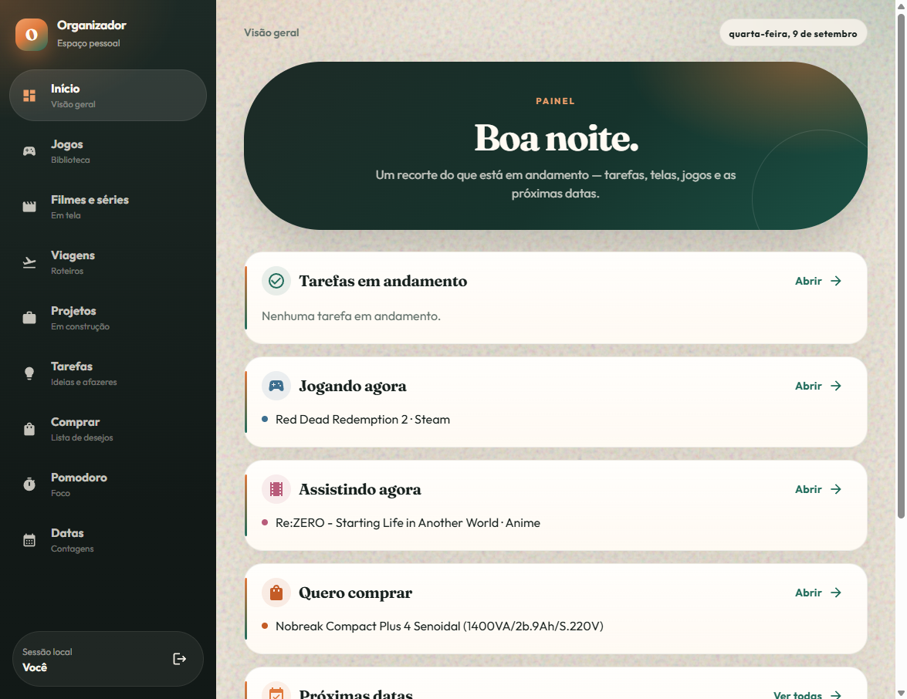
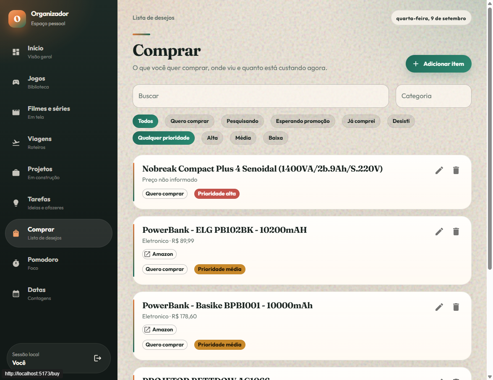
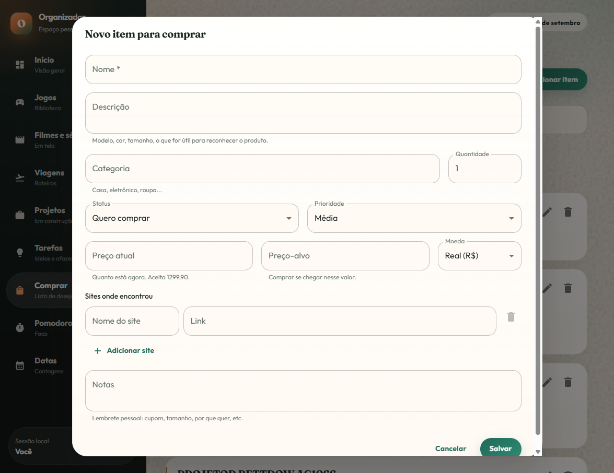
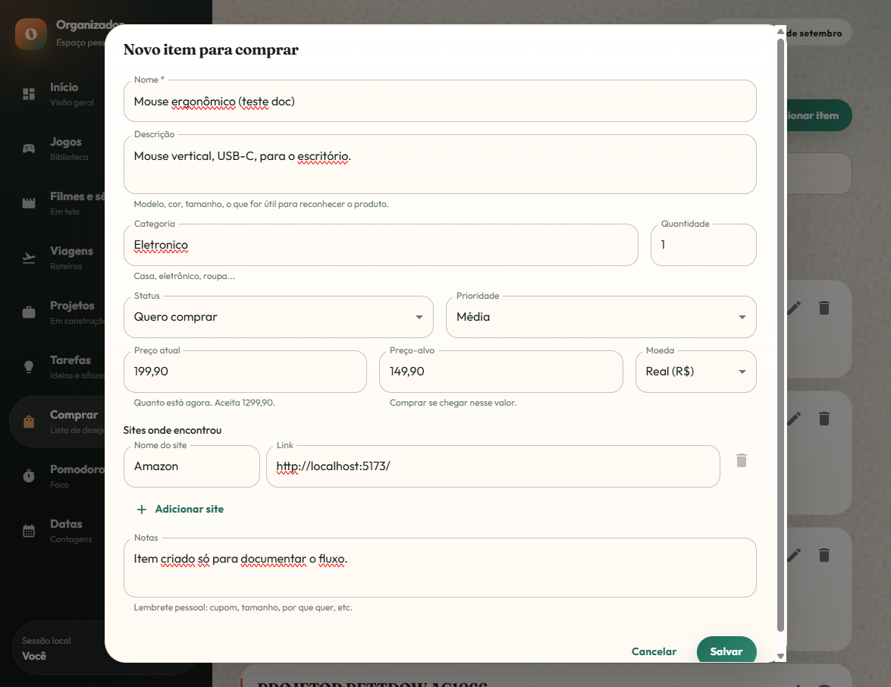
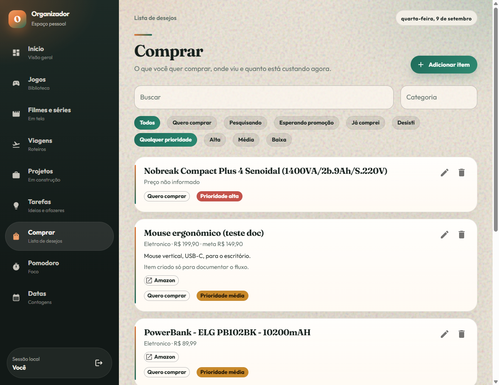
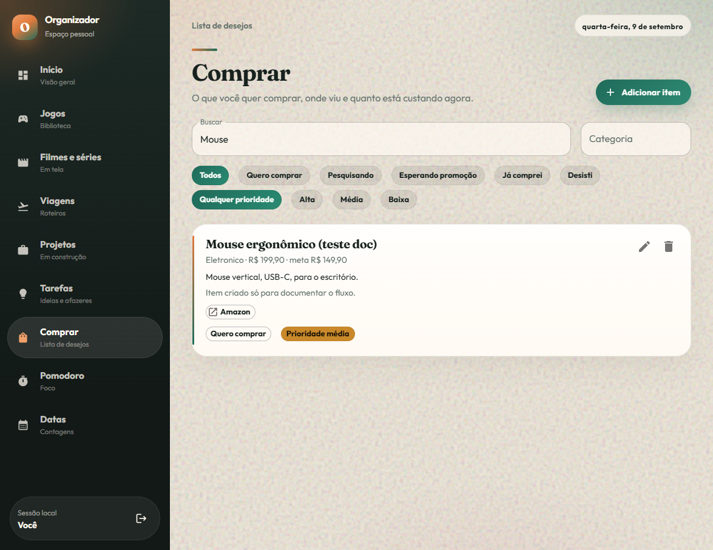
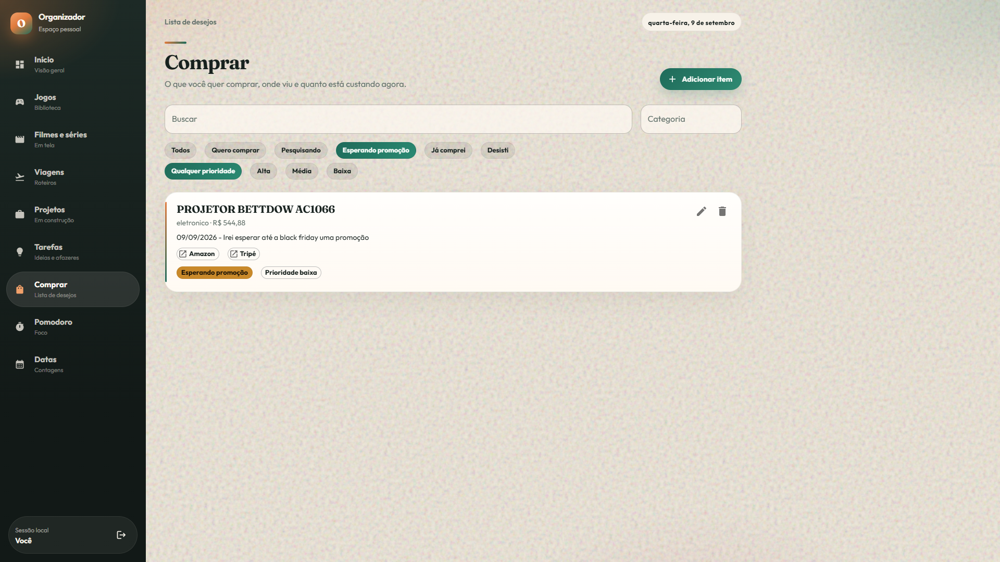
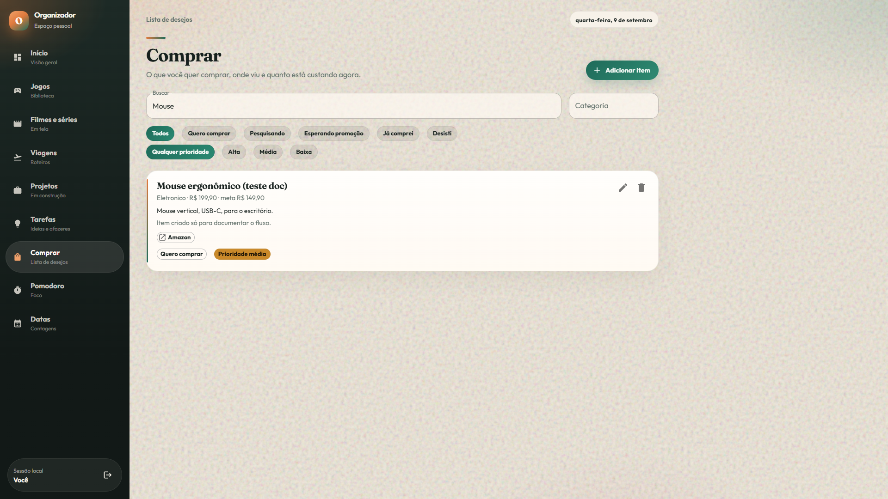
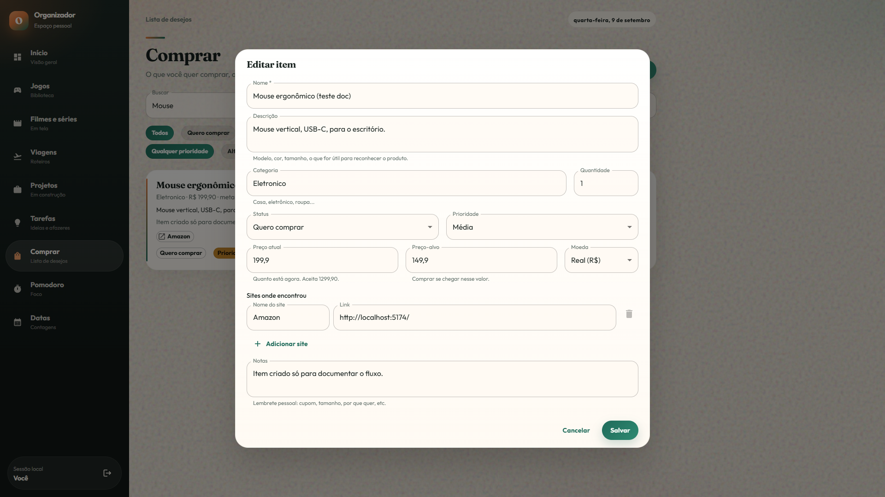
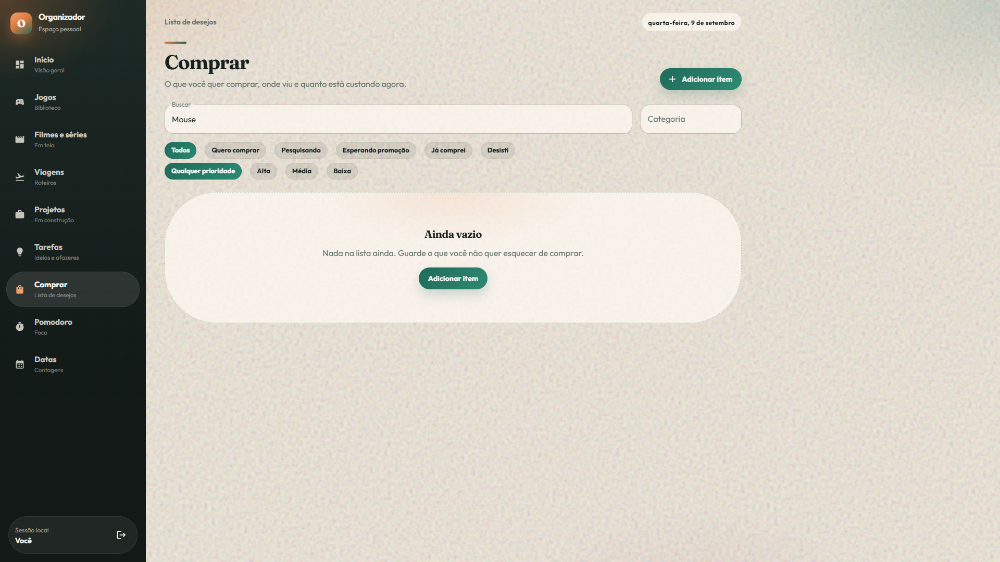

# Funcionalidade Comprar

Testes feitos em **9 de setembro de 2026** na aplicação local (`http://localhost:5173/`), já autenticada. Menu: **Comprar → Lista de desejos**. Rota: `/buy`.

Os prints estão em `docs/compras/screenshots/`.

---

## O que a tela faz

Lista de desejos de compra: nome, preço atual, preço-alvo, moeda (R$, US$, €), quantidade, categoria, status, prioridade, links de loja e notas. O painel inicial mostra um recorte em **Quero comprar**.

**Status:** Quero comprar · Pesquisando · Esperando promoção · Já comprei · Desisti  
**Prioridade:** Alta · Média · Baixa

---

## 1. Início — card Quero comprar

O menu **Comprar** aparece na barra lateral. No painel, o card **Quero comprar** listava o nobreak e o atalho **Abrir** vai para `/buy`.

**Resultado:** ok.

---

## 2. Lista de itens

Cabeçalho **Comprar**, busca, categoria, chips de status e prioridade, botão **Adicionar item**. Cada card mostra preço (ou “Preço não informado”), meta, notas, chips de loja, status e prioridade, além de editar e excluir.

Itens vistos no teste: nobreak (prioridade alta, sem preço), dois power banks (Amazon), projetor (esperando promoção, Amazon + Tripé) e soundbar.

**Resultado:** ok.

---

## 3. Novo item

**Adicionar item** abre o diálogo **Novo item para comprar**. Campos preenchidos no teste:

| Campo | Valor |
| --- | --- |
| Nome | Mouse ergonômico (teste doc) |
| Descrição | Mouse vertical, USB-C, para o escritório. |
| Categoria | Eletronico |
| Quantidade | 1 |
| Status / prioridade | Quero comprar / Média |
| Preço atual / alvo | 199,90 / 149,90 |
| Moeda | Real (R$) |
| Site | Amazon — `http://localhost:5173/` (link local só para o teste) |
| Notas | Item criado só para documentar o fluxo. |

Diálogo vazio:

Formulário preenchido:

**Salvar** mostrou **Salvando...** e fechou o diálogo. O mouse entrou na lista com `Eletronico · R$ 199,90 · meta R$ 149,90` e chip **Quero comprar**.

Busca `Mouse` isolou o item de teste:

**Resultado:** ok. O chip **No preço-alvo** não apareceu (preço atual acima da meta), o que está correto.

---

## 4. Filtro por status

Chip **Esperando promoção**: só o projetor BETTDOW (R$ 544,88, nota da Black Friday, links Amazon e Tripé, prioridade baixa).

**Todos** devolveu a lista completa. **Resultado:** ok.

---

## 5. Busca

Campo **Buscar** com `Mouse` (há um pequeno atraso): ficou só o item de teste.

**Resultado:** ok.

---

## 6. Editar

O lápis abre **Editar item** com os dados já preenchidos (preços como `199,9` / `149,9`). **Cancelar** / Escape fecha sem gravar.

**Resultado:** ok.

---

## 7. Excluir

A lixeira remove na hora, sem confirmação. Com a busca ainda em `Mouse`, a lista ficou vazia.

Os outros itens reais não foram apagados: o vazio é só o filtro da busca. **Resultado:** exclusão ok.

---

## Observações

1. Com busca sem resultado, a mensagem é **Ainda vazio / Nada na lista ainda**, igual à lista realmente vazia. Os outros itens continuam no banco.
2. Excluir não pede confirmação.
3. O card do Início **Quero comprar** só mostra itens nesse status (ex.: o projetor em promoção não entra nesse recorte).

---

## Resumo dos testes

| Fluxo | Status |
| --- | --- |
| Menu e card no Início | Ok |
| Lista `/buy` | Ok |
| Criar item | Ok |
| Filtro de status | Ok |
| Busca | Ok |
| Editar (abrir e cancelar) | Ok |
| Excluir item de teste | Ok |
